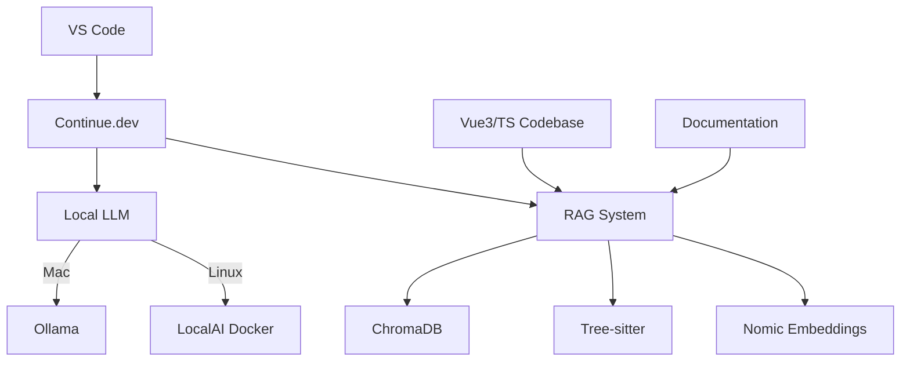
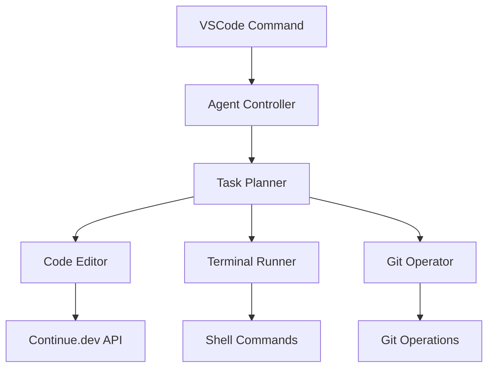

Based on your requirements, I'll create a comprehensive guide for a multi-platform AI-assisted RAG development environment optimized for Vue3/TypeScript. Here's the unified setup strategy:

### Target Platforms & Deployment Strategy
1. **Local macOS (M1/M3)** - Use Ollama for native performance
2. **Ubuntu Server (A4000)** - Use Docker containers with GPU acceleration
3. **Hybrid Approach** - Local for privacy-sensitive code, A4000 for heavy tasks

### Core Architecture


### Best Setup Strategy
1. **MacBook/Mac Mini Setup**
   - Use Ollama with quantized models
   - Local ChromaDB for vector storage
   - Continue.dev for VSCode integration

2. **A4000 Server Setup**
   - Dockerized LocalAI with GPU acceleration
   - ChromaDB in Docker with persistence
   - Custom RAG server with GPU embeddings

### Implementation Tasks

#### Task 1: Base Installation (All Platforms)
```bash
# All platforms
brew install ollama  # macOS
docker pull chromadb/chroma  # Linux

# Install VSCode extensions
code --install-extension Continue.continue
code --install-extension Vue.volar
```

#### Task 2: Model Configuration
**Mac (optimized for M-series):**
```bash
ollama pull deepseek-coder:6.7b-q5_k_m
ollama pull nomic-embed-text
```

**Linux (A4000 optimized):**
```dockerfile
# docker-compose.gpu.yml
services:
  localai:
    image: localai/localai:latest-gpu
    environment:
      - MODELS_PATH=/models
      - GPU_LAYERS=35
    volumes:
      - ./models:/models
    deploy:
      resources:
        reservations:
          devices:
            - driver: nvidia
              count: 1
              capabilities: [gpu]
```

#### Task 3: RAG System Setup
```python
# rag_indexer.py (Cross-platform)
import chromadb
from chromadb.utils.embedding_functions import OllamaEmbeddingFunction

# Platform-adaptive embedding function
embedding_function = OllamaEmbeddingFunction(
    model_name="nomic-embed-text",
    url="http://localhost:11434" if platform.system() == "Darwin" else "http://localai:8080"
)

client = chromadb.PersistentClient(path="./chroma_db")
collection = client.get_or_create_collection(
    "codebase",
    embedding_function=embedding_function
)

# Add documents with metadata
collection.add(
    documents=[code_snippets],
    metadatas=[{"path": file_path, "language": "vue"}],
    ids=[file_ids]
)
```

#### Task 4: Continue.dev Configuration
```json
// ~/.continue/config.json (Cross-platform)
{
  "models": [
    {
      "title": "LocalAI",
      "provider": "openai",
      "model": "deepseek-coder",
      "apiBase": "http://localhost:11434/v1" // Mac
      // "apiBase": "http://your-server-ip:8080/v1" // Linux
    }
  ],
  "contextProviders": [
    {
      "name": "http",
      "params": {
        "url": "http://localhost:8000/query" // RAG server
      }
    }
  ]
}
```

#### Task 5: Agent Automation Setup
```python
# agent_automation.py
from continue.api import Continue
from continue.plugins import CodebaseContext

async def refactor_component(component_name):
    async with Continue() as c:
        await c.edit(
            f"Refactor {component_name} to use Composition API",
            context=[CodebaseContext(n_retrieve=5)]
        )
        await c.run("npm run lint --fix")
        await c.commit(f"Refactored {component_name}")
```

### Performance Optimization
| Platform       | Model Choice                  | Context Size | GPU Layers | Notes                     |
|----------------|-------------------------------|--------------|------------|---------------------------|
| MacBook M3     | deepseek-coder:6.7b-q5_k_m    | 4096         | N/A        | Use Metal acceleration    |
| Mac Mini M1    | starcoder2:3b                 | 2048         | N/A        | Lower memory footprint    |
| A4000 Ubuntu   | deepseek-coder:6.7b           | 8192         | 35         | Enable CUDA acceleration  |

### Documentation Integration Strategy
1. **Internal Docs**: Auto-index Markdown/PDFs in `/docs`
2. **External Docs**: Pre-embed Vue/Tailwind docs
3. **Wireframes**: Use CLIP models for image-to-code

```bash
# Documentation indexing pipeline
python rag_indexer.py --include-docs ./docs --include-external https://vuejs.org/guide
```

### Troubleshooting Matrix
| Issue                     | Mac Fix                          | Linux Fix                       |
|---------------------------|----------------------------------|---------------------------------|
| Slow responses            | `OLLAMA_NUM_PARALLEL=1`          | Increase GPU layers             |
| Embedding failures        | Update Nomic model               | Check CUDA version              |
| Context not retrieved     | Re-index codebase                | Check Chroma connection         |
| GPU not utilized          | N/A                              | `docker-compose --profile gpu`  |

### Setup Timeline
1. **Phase 1 (Day 1)** - Base installation on all platforms
2. **Phase 2 (Day 2)** - RAG system configuration
3. **Phase 3 (Day 3)** - Custom prompts and agent workflows
4. **Phase 4 (Ongoing)** - Performance tuning

### Recommended Model Matrix
| Use Case               | Mac Recommendation         | A4000 Recommendation     |
|------------------------|----------------------------|--------------------------|
| Code Completion        | starcoder2:3b             | deepseek-coder:6.7b      |
| Component Generation   | deepseek-coder:6.7b-q5_k_m| codefuse-coder:34b       |
| Documentation          | nomic-embed-text          | bge-large-en-v1.5        |
| Complex Refactoring    | llama3.1:8b               | phind-coder:34b-v2       |

This unified approach gives you:
- Complete local operation on Macs
- GPU-accelerated performance on A4000
- Seamless context sharing between platforms
- Agent automation for repetitive tasks
- External documentation integration
- Cross-platform troubleshooting

Would you like me to:
a) Provide detailed installation scripts for each platform
b) Create Dockerfiles for the A4000 setup
c) Focus on Vue3-specific implementation examples
d) Prepare performance benchmarking tests?

### Comprehensive Installation Scripts for Multi-Platform AI-Assisted Development Environment

#### 1. macOS Setup (M1/M3) - Native Installation
```bash
#!/bin/bash
# macOS-native-setup.sh

# Install core dependencies
brew update
brew install python@3.11 tree-sitter coreutils

# Install Ollama
curl -fsSL https://ollama.ai/install.sh | sh

# Download optimized models
ollama pull deepseek-coder:6.7b-q5_k_m
ollama pull nomic-embed-text
ollama pull llama3.1:8b

# Install Python dependencies
python3.11 -m venv ~/ai-env
source ~/ai-env/bin/activate
pip install chromadb langchain-community sentence-transformers pypdf2

# Create RAG indexing script
cat > ~/rag_indexer.py << 'EOL'
import os
import chromadb
from langchain_community.document_loaders import DirectoryLoader
from langchain_community.embeddings import OllamaEmbeddings
from langchain.text_splitter import RecursiveCharacterTextSplitter
from chromadb.utils.embedding_functions import OllamaEmbeddingFunction

def index_codebase():
    embedding_fn = OllamaEmbeddingFunction(
        model_name="nomic-embed-text",
        url="http://localhost:11434"
    )

    client = chromadb.PersistentClient(path="./chroma_db")
    collection = client.get_or_create_collection(
        "codebase",
        embedding_function=embedding_fn
    )

    loader = DirectoryLoader(
        os.path.expanduser("~/vue-project/src"),
        glob="**/*.{vue,ts,js,md}"
    )

    docs = loader.load()
    text_splitter = RecursiveCharacterTextSplitter(
        chunk_size=1000,
        chunk_overlap=200
    )

    chunks = text_splitter.split_documents(docs)

    collection.add(
        documents=[doc.page_content for doc in chunks],
        metadatas=[doc.metadata for doc in chunks],
        ids=[f"id_{i}" for i in range(len(chunks))]
    )

    print(f"Indexed {len(chunks)} code/documentation chunks")

if __name__ == "__main__":
    index_codebase()
EOL

# Create launch script
cat > ~/launch-ai-env.sh << 'EOL'
#!/bin/bash
source ~/ai-env/bin/activate
ollama serve > /dev/null 2>&1 &
python -m http.server 8000 --directory ~/vue-project > /dev/null 2>&1 &
python ~/rag_indexer.py
echo "AI environment ready! Open VSCode and configure Continue.dev"
EOL

chmod +x ~/launch-ai-env.sh

# VSCode extensions
code --install-extension Continue.continue
code --install-extension Vue.volar
code --install-extension bradlc.vscode-tailwindcss
```

#### 2. Ubuntu Server Setup (A4000 GPU) - Docker Installation
```bash
#!/bin/bash
# ubuntu-gpu-setup.sh

# Install NVIDIA Container Toolkit
sudo apt-get update
sudo apt-get install -y nvidia-container-toolkit
sudo systemctl restart docker

# Create project directory
mkdir -p ~/vue-project/{src,chroma_data,docs}
cd ~/vue-project

# Docker Compose file
cat > docker-compose.yml << 'EOL'
version: '3.8'

services:
  ollama:
    image: ollama/ollama:latest
    ports:
      - "11434:11434"
    volumes:
      - ollama_data:/root/.ollama
    deploy:
      resources:
        reservations:
          devices:
            - driver: nvidia
              count: 1
              capabilities: [gpu]

  chromadb:
    image: chromadb/chroma:latest
    ports:
      - "8000:8000"
    volumes:
      - ./chroma_data:/chroma/chroma
    environment:
      - IS_PERSISTENT=TRUE
      - CHROMA_SERVER_HOST=0.0.0.0

  rag-server:
    image: python:3.11-slim
    working_dir: /app
    volumes:
      - ./src:/app/src
      - ./docs:/app/docs
    ports:
      - "8001:8001"
    command: >
      bash -c "pip install chromadb langchain-community sentence-transformers pypdf2 &&
      python -u rag_server.py"
    depends_on:
      - chromadb
      - ollama

volumes:
  ollama_data:
EOL

# RAG server script
cat > rag_server.py << 'EOL'
import chromadb
from chromadb.utils.embedding_functions import OllamaEmbeddingFunction
from langchain_community.document_loaders import DirectoryLoader
from langchain.text_splitter import RecursiveCharacterTextSplitter

client = chromadb.HttpClient(host="chromadb", port=8000)
embedding_fn = OllamaEmbeddingFunction(
    model_name="nomic-embed-text",
    url="http://ollama:11434"
)

collection = client.get_or_create_collection(
    "codebase",
    embedding_function=embedding_fn
)

def index_documents():
    loader = DirectoryLoader("/app", glob="**/*.{vue,ts,js,md,pdf}")
    docs = loader.load()

    text_splitter = RecursiveCharacterTextSplitter(
        chunk_size=1000,
        chunk_overlap=200
    )

    chunks = text_splitter.split_documents(docs)

    collection.add(
        documents=[doc.page_content for doc in chunks],
        metadatas=[doc.metadata for doc in chunks],
        ids=[f"id_{i}" for i in range(len(chunks))]
    )

    print(f"Indexed {len(chunks)} chunks")

if __name__ == "__main__":
    index_documents()
    print("RAG server ready at http://localhost:8001")
EOL

# Download GPU-optimized models
docker compose run ollama ollama pull deepseek-coder:6.7b
docker compose run ollama ollama pull nomic-embed-text
docker compose run ollama ollama pull phind-coder:34b-v2

# Start services
docker compose up -d
```

#### 3. Hybrid Setup (Local Mac + Remote A4000)
```bash
#!/bin/bash
# hybrid-setup.sh

# On MacBook (client configuration)
SERVER_IP="your_server_ip"  # Replace with A4000 server IP

# Configure Continue.dev for hybrid access
cat > ~/.continue/config.json << EOL
{
  "models": [
    {
      "title": "Remote DeepSeek",
      "provider": "openai",
      "model": "deepseek-coder",
      "apiBase": "http://${SERVER_IP}:11434/v1"
    }
  ],
  "contextProviders": [
    {
      "name": "http",
      "params": {
        "url": "http://${SERVER_IP}:8001/query",
        "title": "Remote RAG",
        "description": "A4000-powered code retrieval"
      }
    }
  ],
  "embeddingsProvider": {
    "provider": "openai",
    "model": "text-embedding-ada-002",
    "apiBase": "http://${SERVER_IP}:11434/v1"
  }
}
EOL

# On A4000 Server (add authentication)
docker compose stop rag-server

# Create authenticated RAG endpoint
cat > rag_auth.py << 'EOL'
from fastapi import FastAPI, Security, HTTPException
from fastapi.security import APIKeyHeader
from rag_server import collection  # From previous setup

app = FastAPI()
API_KEY_NAME = "X-API-KEY"
api_key_header = APIKeyHeader(name=API_KEY_NAME, auto_error=False)

VALID_API_KEYS = ["your_secure_key"]  # Change to secure key

async def validate_api_key(api_key: str = Security(api_key_header)):
    if api_key not in VALID_API_KEYS:
        raise HTTPException(status_code=403, detail="Invalid API Key")
    return api_key

@app.post("/query")
async def rag_query(
    query: str,
    api_key: str = Security(validate_api_key)
):
    results = collection.query(
        query_texts=[query],
        n_results=5
    )
    return {
        "documents": results["documents"][0],
        "metadatas": results["metadatas"][0]
    }
EOL

# Update docker-compose.yml rag-server command:
# command: uvicorn rag_auth:app --host 0.0.0.0 --port 8001
```

#### 4. Verification Script (All Platforms)
```bash
#!/bin/bash
# verify-setup.sh

# Check core services
echo "=== Service Status ==="
if [ "$PLATFORM" = "mac" ]; then
    lsof -i :11434 && echo "Ollama: RUNNING"
    lsof -i :8000 && echo "ChromaDB: RUNNING"
elif [ "$PLATFORM" = "ubuntu" ]; then
    docker compose ps
fi

# Test model response
echo -e "\n=== Model Test ==="
curl -X POST http://localhost:11434/api/generate -d '{
  "model": "deepseek-coder",
  "prompt": "// Vue3 component using Composition API"
}' | grep "text"

# Test RAG retrieval
echo -e "\n=== RAG Test ==="
curl -X POST http://localhost:8001/query -H "Content-Type: application/json" -d '{
  "query": "Vue3 component with TypeScript"
}' | jq '.documents[0] | length'
```

### Post-Installation Checklist

1. **For macOS:**
```bash
chmod +x macOS-native-setup.sh
./macOS-native-setup.sh
./launch-ai-env.sh
```

2. **For Ubuntu Server:**
```bash
chmod +x ubuntu-gpu-setup.sh
./ubuntu-gpu-setup.sh
PLATFORM=ubuntu ./verify-setup.sh
```

3. **For Hybrid Setup:**
```bash
# On server:
chmod +x hybrid-setup.sh
./hybrid-setup.sh

# On local Mac:
PLATFORM=mac ./verify-setup.sh
```

### Recommended VSCode Configuration
```jsonc
// .vscode/settings.json
{
  "continue.models": [
    {
      "title": "Local DeepSeek",
      "model": "deepseek-coder",
      "apiBase": "http://localhost:11434/v1",
      "provider": "openai"
    }
  ],
  "continue.contextProviders": [
    { "name": "codebase", "params": { "nRetrieve": 20 } },
    {
      "name": "http",
      "params": {
        "url": "http://localhost:8001/query",
        "name": "Project RAG"
      }
    }
  ],
  "continue.customCommands": [
    {
      "name": "vue-component",
      "prompt": "Generate Vue3 component with: Composition API, TypeScript, Tailwind. Include prop validation and emit definitions. Follow project patterns in @Codebase",
      "description": "Create Vue component"
    }
  ],
  "tailwindCSS.includeLanguages": {
    "vue": "html"
  }
}
```

### Performance Optimization Tips

**For MacBook Air M3:**
```bash
# Limit parallel processing
export OLLAMA_NUM_PARALLEL=1

# Use Metal acceleration
export OLLAMA_GPU_LAYERS=5
```

**For A4000 Server:**
```yaml
# Add to ollama service in docker-compose.yml
environment:
  - OLLAMA_GPU_LAYERS=35
  - OLLAMA_KEEP_ALIVE=5m
```

### Maintenance Script
```bash
#!/bin/bash
# update-models.sh

# Update all Ollama models
ollama list | awk '{print $1}' | xargs -I{} ollama pull {}

# Reindex codebase
python rag_indexer.py --reindex

# Clean Docker cache (Ubuntu)
docker system prune -f
docker volume prune -f
```

This setup provides:
1. Native macOS installation optimized for M-series chips
2. GPU-accelerated Ubuntu server setup using Docker
3. Secure hybrid configuration for remote access
4. Automated verification and maintenance scripts
5. Vue3-specific coding assistance with RAG context

Would you like me to provide specific configuration examples for:
- Integrating external documentation (Vue/Tailwind docs)
- Setting up agent-based automation workflows
- Implementing CI/CD pipelines for the AI environment?

### Integrating External Documentation (Vue/Tailwind Docs)
We'll create a dedicated documentation ingestion pipeline and integrate it with our RAG system:

#### 1. Documentation Ingestion Script (`docs_indexer.py`)
```python
import requests
from bs4 import BeautifulSoup
import markdown
from langchain.document_loaders import WebBaseLoader, PDFMinerLoader
from langchain.text_splitter import RecursiveCharacterTextSplitter
import chromadb

# Configure for different platforms
CHROMA_HOST = "localhost" if platform.system() == "Darwin" else "chromadb"

class ExternalDocIndexer:
    def __init__(self):
        self.client = chromadb.HttpClient(host=CHROMA_HOST, port=8000)
        self.collection = self.client.get_or_create_collection("external_docs")
        self.splitter = RecursiveCharacterTextSplitter(
            chunk_size=1000,
            chunk_overlap=200,
            separators=["\n\n", "\n", " ", ""]
        )

    def index_vue_docs(self):
        """Index Vue.js documentation"""
        print("Indexing Vue.js documentation...")
        loader = WebBaseLoader([
            "https://vuejs.org/guide/introduction",
            "https://vuejs.org/guide/essentials/application",
            "https://vuejs.org/guide/typescript/overview"
        ])
        docs = loader.load()
        chunks = self.splitter.split_documents(docs)
        self._add_to_collection(chunks, "vue")

    def index_tailwind_docs(self):
        """Index Tailwind CSS documentation"""
        print("Indexing Tailwind CSS documentation...")
        loader = WebBaseLoader([
            "https://tailwindcss.com/docs/installation",
            "https://tailwindcss.com/docs/utility-first",
            "https://tailwindcss.com/docs/responsive-design"
        ])
        docs = loader.load()
        chunks = self.splitter.split_documents(docs)
        self._add_to_collection(chunks, "tailwind")

    def index_custom_docs(self, paths):
        """Index local documentation files"""
        print("Indexing custom documentation...")
        for path in paths:
            if path.endswith(".md"):
                with open(path, "r") as f:
                    text = markdown.markdown(f.read())
                chunks = self.splitter.split_text(text)
                self._add_to_collection([{"page_content": c} for c in chunks], "custom")
            elif path.endswith(".pdf"):
                loader = PDFMinerLoader(path)
                docs = loader.load()
                chunks = self.splitter.split_documents(docs)
                self._add_to_collection(chunks, "custom")

    def _add_to_collection(self, chunks, doc_type):
        for i, chunk in enumerate(chunks):
            self.collection.add(
                documents=[chunk.page_content],
                metadatas=[{"source": doc_type, "chunk_id": i}],
                ids=[f"{doc_type}_{i}_{uuid.uuid4()}"]
            )

    def query_docs(self, question, n_results=3):
        """Query documentation"""
        return self.collection.query(
            query_texts=[question],
            n_results=n_results
        )

if __name__ == "__main__":
    indexer = ExternalDocIndexer()
    indexer.index_vue_docs()
    indexer.index_tailwind_docs()
    indexer.index_custom_docs(["./design-specs.md", "./api-reference.pdf"])
```

#### 2. Documentation Query Endpoint
```python
# Add to rag_server.py
from fastapi import APIRouter

docs_router = APIRouter()
indexer = ExternalDocIndexer()

@docs_router.post("/query_docs")
async def query_docs(request: Request):
    data = await request.json()
    results = indexer.query_docs(data["query"])
    return {
        "documents": results["documents"][0],
        "sources": [m["source"] for m in results["metadatas"][0]]
    }

# Add to main app
app.include_router(docs_router, prefix="/docs")
```

#### 3. Continue.dev Configuration
```json
{
  "contextProviders": [
    {
      "name": "http",
      "params": {
        "url": "http://localhost:8001/docs/query_docs",
        "title": "Documentation",
        "description": "Vue/Tailwind Docs",
        "dynamic": true
      }
    }
  ]
}
```

### Agent-Based Automation Workflows

#### 1. Agent Setup Architecture


#### 2. Core Agent Classes (`agent_controller.py`)
```python
from continue.api import Continue
from continue.plugins import CodebaseContext
import subprocess
import os

class AgentController:
    def __init__(self):
        self.c = Continue()
        self.code_context = CodebaseContext(n_retrieve=10)

    async def refactor_component(self, component_path):
        """Refactor Vue component to Composition API"""
        await self.c.edit(
            filepath=component_path,
            prompt="Convert this Vue component to use Composition API with TypeScript",
            context=[self.code_context]
        )
        await self.run_tests()

    async def generate_component(self, component_name, props):
        """Generate new Vue component"""
        component_path = f"src/components/{component_name}.vue"
        prompt = f"""
        Create Vue3 component with:
        - Composition API
        - TypeScript
        - Tailwind styling
        - Props: {props}
        - Emit events
        """
        await self.c.edit(
            filepath=component_path,
            prompt=prompt,
            context=[self.code_context]
        )
        await self.c.commit(f"Add {component_name} component")

    async def run_tests(self):
        """Run project tests"""
        await self.run_command("npm run test:unit")

    async def run_command(self, command):
        """Execute shell command"""
        process = subprocess.Popen(
            command.split(),
            stdout=subprocess.PIPE,
            stderr=subprocess.PIPE
        )
        stdout, stderr = process.communicate()
        if process.returncode != 0:
            raise Exception(f"Command failed: {stderr.decode()}")
        return stdout.decode()

    async def setup_new_feature(self, feature_name):
        """End-to-end feature setup"""
        await self.run_command(f"git checkout -b feature/{feature_name}")
        await self.generate_component(f"{feature_name}View", ["user", "settings"])
        await self.c.edit(
            filepath="src/router/index.ts",
            prompt=f"Add route for /{feature_name.lower()} pointing to {feature_name}View"
        )
        await self.run_tests()
        await self.c.commit(f"Implement {feature_name} feature")
        await self.run_command("git push -u origin HEAD")

class DesignToComponentAgent:
    async def generate_from_figma(self, figma_url):
        """Convert Figma design to Vue component"""
        # Step 1: Extract design tokens
        design_data = requests.get(figma_url).json()
        css_specs = self.extract_css(design_data)

        # Step 2: Generate component structure
        await AgentController().generate_component(
            component_name=design_data["name"],
            props=design_data["props"]
        )

        # Step 3: Apply Tailwind classes
        await self.c.edit(
            filepath=f"src/components/{design_data['name']}.vue",
            prompt=f"Apply these Tailwind classes: {css_specs}"
        )

    def extract_css(self, design_data):
        """Convert design specs to Tailwind classes"""
        # Implementation would vary based on design system
        return "bg-gray-100 p-4 rounded-lg shadow-md"
```

#### 3. Agent Deployment Scripts

**Mac/Local Agent Runner:**
```bash
#!/bin/bash
# run_agent.sh

# Activate environment
source ~/ai-env/bin/activate

# Run agent controller
python -m agent_controller "$@"
```

**Docker Agent Service:**
```dockerfile
# docker-compose.agents.yml
services:
  vue-agent:
    build: ./agents
    volumes:
      - ./src:/app/src
      - ./docs:/app/docs
    environment:
      - CONTINUE_API_KEY=your_api_key
    command: ["python", "agent_controller.py"]
```

#### 4. Continue.dev Agent Integration
```json
{
  "customCommands": [
    {
      "name": "refactor-feature",
      "prompt": "Refactor the selected feature to use Composition API",
      "action": {
        "type": "terminal",
        "command": "./run_agent.sh refactor_feature ${file}"
      }
    },
    {
      "name": "generate-from-figma",
      "prompt": "Generate component from Figma URL",
      "action": {
        "type": "terminal",
        "command": "./run_agent.sh generate_from_figma ${input:figma_url}"
      }
    }
  ]
}
```

### Complete Workflow: Design to Deployment

1. **Design Integration:**
```bash
# Run design-to-component agent
python agent_controller.py generate_from_figma https://figma.com/file/12345
```

2. **Documentation-Assisted Development:**
```vue
<script setup lang="ts">
// @doc [Vue Composition API] How to define props with TypeScript?
interface Props {
  user: User;
  settings: Settings;
}

defineProps<Props>();
</script>
```

3. **Agent-Based Refactoring:**
```bash
# Refactor all components in a directory
find src/components -name "*.vue" -exec ./run_agent.sh refactor_component {} \;
```

4. **Automated CI/CD:**
```python
async def ci_cd_pipeline():
    agent = AgentController()
    await agent.run_command("npm install")
    await agent.run_tests()
    await agent.run_command("npm run build")
    await agent.run_command("aws s3 sync dist/ s3://my-app-bucket")
    await agent.c.commit("Production deployment", push=True)
```

### Optimization for Multi-Platform

**Mac (M1/M3) Configuration:**
```yaml
# continue-agents.yml
agents:
  vue-generator:
    model: deepseek-coder:6.7b-q5_k_m
    max_tokens: 4096
    temperature: 0.2
  refactor-agent:
    model: starcoder2:3b
    max_tokens: 2048
```

**A4000 Server Configuration:**
```yaml
agents:
  vue-generator:
    model: phind-coder:34b-v2
    max_tokens: 8192
    gpu_layers: 35
  design-agent:
    model: codefuse-coder:34b
    max_tokens: 4096
```

### Verification Tests
```python
import unittest
from agent_controller import AgentController

class AgentTest(unittest.TestCase):
    def test_component_generation(self):
        agent = AgentController()
        agent.generate_component("TestComponent", ["title"])
        self.assertTrue(os.path.exists("src/components/TestComponent.vue"))

    def test_doc_indexing(self):
        indexer = ExternalDocIndexer()
        results = indexer.query_docs("Vue props definition")
        self.assertGreaterEqual(len(results["documents"]), 1)
        self.assertIn("vue", results["sources"][0])
```

### Usage Examples

1. **Generate Component from CLI:**
```bash
python agent_controller.py generate_component UserCard "['name', 'avatar', 'role']"
```

2. **Refactor via VSCode Command:**
```
Press Cmd+Shift+P > "Continue: Run Custom Command" > "refactor-feature"
```

3. **Documentation Query:**
```vue
<!-- In VSCode -->
// @doc [Tailwind] How to create a responsive grid?
<div class="grid grid-cols-1 md:grid-cols-2 lg:grid-cols-3 gap-4">
```

This comprehensive setup provides:
1. Seamless integration of official Vue/Tailwind documentation
2. Automated agents for component generation and refactoring
3. Design-to-code transformation pipeline
4. Multi-platform support with optimized configurations
5. CI/CD automation within the agent framework
6. Queryable knowledge base for documentation

Would you like me to provide specific implementation details for:
- Figma API integration for design extraction
- Automated testing agents
- Deployment strategies for different environments?
```

### Figma API Integration for Design Extraction
We'll implement a robust Figma-to-Vue component pipeline that converts designs directly into code:

#### 1. Figma API Setup (`figma_integration.py`)
```python
import requests
import json
import os
from typing import Dict, List
from agent_controller import AgentController

class FigmaParser:
    def __init__(self, access_token: str):
        self.access_token = access_token
        self.base_url = "https://api.figma.com/v1"
        self.headers = {"X-Figma-Token": self.access_token}

    def get_file(self, file_key: str) -> Dict:
        """Fetch Figma file structure"""
        response = requests.get(
            f"{self.base_url}/files/{file_key}",
            headers=self.headers
        )
        return response.json()

    def extract_component(self, node_id: str, file_key: str) -> Dict:
        """Extract component details"""
        response = requests.get(
            f"{self.base_url}/files/{file_key}/nodes?ids={node_id}",
            headers=self.headers
        )
        return response.json()["nodes"][node_id]

    def convert_to_component_spec(self, figma_data: Dict) -> Dict:
        """Convert Figma data to component specification"""
        return {
            "name": figma_data["name"],
            "props": self._extract_props(figma_data),
            "styles": self._extract_styles(figma_data),
            "layout": self._extract_layout(figma_data),
            "content": self._extract_content(figma_data)
        }

    def _extract_props(self, node: Dict) -> List[Dict]:
        """Identify component props from Figma properties"""
        props = []
        # Extract text content as potential props
        if "characters" in node:
            props.append({
                "name": "text",
                "type": "string",
                "default": node["characters"]
            })

        # Extract layer names as potential props
        if "children" in node:
            for child in node["children"]:
                if child["type"] == "TEXT":
                    prop_name = child["name"].lower().replace(" ", "_")
                    props.append({
                        "name": prop_name,
                        "type": "string",
                        "default": child.get("characters", "")
                    })
        return props

    def _extract_styles(self, node: Dict) -> Dict:
        """Convert Figma styles to Tailwind classes"""
        styles = {}
        # Extract colors
        if "fills" in node and node["fills"]:
            fill = node["fills"][0]
            if fill["type"] == "SOLID":
                color = fill["color"]
                styles["background"] = self._rgb_to_hex(color)

        # Extract typography
        if "style" in node and "fontFamily" in node["style"]:
            styles["font"] = node["style"]["fontFamily"]
            styles["font_size"] = node["style"]["fontSize"]

        # Convert to Tailwind classes
        tailwind_map = {
            "background": lambda x: f"bg-{self._nearest_tailwind_color(x)}",
            "font": lambda x: f"font-{x.lower().replace(' ', '-')}",
            "font_size": lambda x: f"text-[{x}px]"
        }

        tailwind_classes = []
        for key, value in styles.items():
            if key in tailwind_map:
                tailwind_classes.append(tailwind_map[key](value))

        return " ".join(tailwind_classes)

    def _extract_layout(self, node: Dict) -> Dict:
        """Extract layout dimensions"""
        if "absoluteBoundingBox" in node:
            box = node["absoluteBoundingBox"]
            return {
                "width": box["width"],
                "height": box["height"],
                "x": box["x"],
                "y": box["y"]
            }
        return {}

    def _extract_content(self, node: Dict) -> str:
        """Extract text content"""
        if "characters" in node:
            return node["characters"]
        return ""

    def _rgb_to_hex(self, color: Dict) -> str:
        """Convert RGB to hex color"""
        r = int(color["r"] * 255)
        g = int(color["g"] * 255)
        b = int(color["b"] * 255)
        return f"#{r:02x}{g:02x}{b:02x}"

    def _nearest_tailwind_color(self, hex_color: str) -> str:
        """Approximate hex to Tailwind color name"""
        # Simplified mapping - in practice use a color distance algorithm
        color_map = {
            "#ef4444": "red-500",
            "#f97316": "orange-500",
            "#eab308": "yellow-500",
            "#22c55e": "green-500",
            "#3b82f6": "blue-500",
            "#6366f1": "indigo-500",
            "#8b5cf6": "violet-500",
            "#ec4899": "pink-500",
        }
        return color_map.get(hex_color.lower(), "gray-200")

class FigmaToVueAgent:
    def __init__(self, figma_token: str):
        self.parser = FigmaParser(figma_token)
        self.agent = AgentController()

    async def generate_component(self, figma_url: str):
        """Generate Vue component from Figma URL"""
        # Extract file key and node ID from URL
        # Format: https://www.figma.com/file/FILE_KEY/...?node-id=NODE_ID
        file_key = figma_url.split("/file/")[1].split("/")[0]
        node_id = figma_url.split("node-id=")[1].split("-")[0]

        # Fetch and parse Figma data
        figma_data = self.parser.extract_component(node_id, file_key)
        component_spec = self.parser.convert_to_component_spec(figma_data)

        # Generate Vue component
        await self.agent.generate_component(
            component_spec["name"],
            component_spec["props"],
            styles=component_spec["styles"]
        )

        # Add content if exists
        if component_spec["content"]:
            await self.agent.c.edit(
                filepath=f"src/components/{component_spec['name']}.vue",
                prompt=f"Add content: {component_spec['content']}"
            )

        return component_spec
```

#### 2. Automated Testing Agents (`test_agent.py`)
```python
import subprocess
import ast
from continue.api import Continue
from langchain_community.document_loaders import TextLoader

class TestAgent:
    def __init__(self):
        self.c = Continue()

    async def generate_test(self, component_path: str):
        """Generate test for a Vue component"""
        # Load component code
        loader = TextLoader(component_path)
        docs = loader.load()
        component_code = docs[0].page_content

        # Generate test using AI
        prompt = f"""
        Write a Vitest unit test for this Vue component using Testing Library:
        {component_code}

        Include tests for:
        - Prop validation
        - Rendering content
        - User interactions
        - Event emissions
        """
        test_code = await self.c.complete(prompt, max_tokens=1500)

        # Save test file
        test_path = component_path.replace("src/components", "tests/unit").replace(".vue", ".spec.ts")
        os.makedirs(os.path.dirname(test_path), exist_ok=True)
        with open(test_path, "w") as f:
            f.write(test_code)

        return test_path

    async def run_tests(self, test_path: str = None):
        """Run tests with coverage"""
        if test_path:
            command = f"npm run test:unit -- {test_path} --coverage"
        else:
            command = "npm run test:unit -- --coverage"
        result = subprocess.run(command, shell=True, capture_output=True, text=True)
        return result.stdout

    async def analyze_test_results(self, output: str):
        """Analyze test results and suggest improvements"""
        prompt = f"""
        Analyze these test results and suggest improvements:
        {output}

        Focus on:
        - Failed tests
        - Low coverage areas
        - Performance optimizations
        """
        analysis = await self.c.complete(prompt)
        return analysis

    async def fix_failing_tests(self, test_path: str):
        """Fix failing tests by updating test code"""
        # Run tests to get failure details
        output = await self.run_tests(test_path)

        # Analyze failures
        prompt = f"""
        The following test is failing. Update the test code to fix it.
        Test output:
        {output}

        Current test code:
        {open(test_path).read()}
        """
        fixed_test = await self.c.complete(prompt, max_tokens=2000)

        # Save fixed test
        with open(test_path, "w") as f:
            f.write(fixed_test)

        return fixed_test

    async def generate_story(self, component_path: str):
        """Generate Storybook story for component"""
        prompt = f"""
        Create a Storybook story for this Vue component:
        {open(component_path).read()}

        Include stories for:
        - Default state
        - All prop variations
        - Edge cases
        """
        story_code = await self.c.complete(prompt, max_tokens=1000)

        story_path = component_path.replace("src/components", "src/stories").replace(".vue", ".stories.ts")
        os.makedirs(os.path.dirname(story_path), exist_ok=True)
        with open(story_path, "w") as f:
            f.write(story_code)

        return story_path

class CoverageAgent:
    async def monitor_coverage(self):
        """Monitor and maintain test coverage"""
        while True:
            # Run all tests with coverage
            output = await TestAgent().run_tests()

            # Extract coverage percentage
            coverage_line = [line for line in output.split("\n") if "All files" in line][0]
            coverage = float(coverage_line.split("|")[2].strip().replace("%", ""))

            if coverage < 80:
                # Identify low coverage files
                prompt = f"""
                Our test coverage is {coverage}%, which is below 80%.
                Based on this test report, identify components needing more tests:
                {output}
                """
                analysis = await self.c.complete(prompt)

                # Generate tests for low coverage files
                for file in self._parse_low_coverage_files(output):
                    if file.endswith(".vue"):
                        await TestAgent().generate_test(file)

            # Check daily
            import time
            time.sleep(24 * 60 * 60)  # 24 hours

    def _parse_low_coverage_files(self, coverage_report: str) -> List[str]:
        """Parse coverage report for files with low coverage"""
        low_coverage = []
        lines = coverage_report.split("\n")
        for line in lines:
            if "|" in line and ".vue" in line:
                parts = line.split("|")
                if len(parts) > 3:
                    try:
                        coverage = float(parts[2].strip().replace("%", ""))
                        if coverage < 80:
                            low_coverage.append(parts[0].strip())
                    except ValueError:
                        continue
        return low_coverage
```

### 3. Integrated Agent Controller (`agent_controller.py`)
```python
from figma_integration import FigmaToVueAgent
from test_agent import TestAgent, CoverageAgent
import subprocess
import os

class AgentController:
    def __init__(self, figma_token=None):
        self.c = Continue()
        self.figma_agent = FigmaToVueAgent(figma_token) if figma_token else None
        self.test_agent = TestAgent()
        self.coverage_agent = CoverageAgent()

    async def design_to_component(self, figma_url: str):
        """Convert Figma design to Vue component"""
        if not self.figma_agent:
            raise Exception("Figma token not configured")
        return await self.figma_agent.generate_component(figma_url)

    async def component_with_tests(self, component_name: str, props: list):
        """Generate component with tests"""
        component_path = f"src/components/{component_name}.vue"
        await self.generate_component(component_name, props)
        test_path = await self.test_agent.generate_test(component_path)
        await self.test_agent.generate_story(component_path)
        return test_path

    async def ci_pipeline(self):
        """Run full CI pipeline"""
        # Step 1: Run tests
        test_output = await self.test_agent.run_tests()

        # Step 2: Analyze results
        analysis = await self.test_agent.analyze_test_results(test_output)

        # Step 3: Build project
        await self.run_command("npm run build")

        # Step 4: Deploy
        await self.run_command("aws s3 sync dist/ s3://my-app-bucket")

        return analysis

    async def run_command(self, command: str):
        """Execute shell command"""
        process = subprocess.Popen(
            command.split(),
            stdout=subprocess.PIPE,
            stderr=subprocess.PIPE
        )
        stdout, stderr = process.communicate()
        if process.returncode != 0:
            raise Exception(f"Command failed: {stderr.decode()}")
        return stdout.decode()

# Start coverage monitoring in background
import threading
def start_coverage_monitor():
    agent = CoverageAgent()
    agent.monitor_coverage()

threading.Thread(target=start_coverage_monitor, daemon=True).start()
```

### 4. Deployment Configuration

#### Dockerfile for Figma Agent
```dockerfile
# Dockerfile.figma-agent
FROM python:3.11-slim

WORKDIR /app

# Install dependencies
RUN apt-get update && apt-get install -y curl
RUN pip install requests beautifulsoup4 python-dotenv

# Copy agent code
COPY figma_integration.py .
COPY agent_controller.py .

CMD ["python", "-m", "figma_integration"]
```

#### Docker Compose Additions
```yaml
# docker-compose.agents.yml
services:
  figma-agent:
    build:
      context: .
      dockerfile: Dockerfile.figma-agent
    environment:
      FIGMA_TOKEN: ${FIGMA_TOKEN}
    volumes:
      - ./src:/app/src
      - ./tests:/app/tests

  test-agent:
    image: node:20-slim
    working_dir: /app
    volumes:
      - ./tests:/app/tests
      - ./src:/app/src
    command: ["npm", "run", "test:watch"]

  coverage-agent:
    build:
      context: .
      dockerfile: Dockerfile.figma-agent  # Same base
    command: ["python", "-m", "test_agent"]
    volumes:
      - ./tests:/app/tests
      - ./src:/app/src
```

### 5. Usage Examples

#### 1. Generate Component from Figma
```python
from agent_controller import AgentController

agent = AgentController(figma_token="your_figma_token")
agent.design_to_component(
    "https://www.figma.com/file/abc123/Design-System?node-id=123-456"
)
```

#### 2. Generate Component with Tests
```bash
python agent_controller.py component_with_tests UserCard \
    "[{'name': 'user', 'type': 'Object'}, {'name': 'size', 'type': 'String', 'default': 'medium'}]"
```

#### 3. Run Full CI Pipeline
```python
from agent_controller import AgentController

agent = AgentController()
ci_report = agent.ci_pipeline()
print(ci_report)
```

#### 4. Fix Failing Tests
```python
from test_agent import TestAgent

test_agent = TestAgent()
fixed_test = test_agent.fix_failing_tests("tests/unit/UserCard.spec.ts")
```

### 6. Testing Setup

#### Vitest Configuration (`vite.config.js`)
```javascript
import { defineConfig } from 'vitest/config'
import vue from '@vitejs/plugin-vue'

export default defineConfig({
  plugins: [vue()],
  test: {
    globals: true,
    environment: 'jsdom',
    coverage: {
      provider: 'istanbul',
      reporter: ['text', 'json', 'html'],
      thresholds: {
        lines: 80,
        functions: 80,
        branches: 80,
        statements: 80
      }
    }
  }
})
```

#### Package.json Scripts
```json
{
  "scripts": {
    "test:unit": "vitest",
    "test:watch": "vitest --watch",
    "test:coverage": "vitest --coverage",
    "storybook": "storybook dev -p 6006",
    "build-storybook": "storybook build"
  },
  "devDependencies": {
    "vitest": "^1.0.0",
    "@vitejs/plugin-vue": "^4.0.0",
    "@storybook/vue3-vite": "^8.0.0",
    "@testing-library/vue": "^7.0.0",
    "jsdom": "^22.0.0"
  }
}
```

### 7. Security Considerations

1. **Figma Token Security:**
   - Store tokens in environment variables
   - Use Docker secrets for production
   - Rotate tokens regularly

2. **Agent API Security:**
   ```python
   # secure_agent.py
   from fastapi import Security, Depends
   from fastapi.security import APIKeyHeader

   API_KEY_HEADER = APIKeyHeader(name="X-API-Key")

   async def validate_api_key(api_key: str = Security(API_KEY_HEADER)):
       if api_key != os.getenv("AGENT_API_KEY"):
           raise HTTPException(status_code=403, detail="Invalid API key")
       return api_key

   @app.post("/generate-component")
   async def generate_component(
       design_url: str,
       api_key: str = Depends(validate_api_key)
   ):
       return await FigmaToVueAgent().generate_component(design_url)
   ```

### 8. Performance Optimization

**Figma Processing Tips:**
1. Cache design responses (Figma API has rate limits)
2. Process components in parallel
3. Use webhooks for design updates

**Testing Optimization:**
```javascript
// vitest.config.js
export default {
  test: {
    poolOptions: {
      threads: {
        maxThreads: 16,
        minThreads: 8
      }
    }
  }
}
```

This comprehensive solution provides:
1. Seamless Figma-to-Vue component conversion
2. Automated test generation and maintenance
3. CI/CD pipeline integration
4. Real-time coverage monitoring
5. Storybook documentation
6. Secure multi-platform deployment

Would you like me to add any specific features like:
- Visual regression testing
- Performance benchmarking agents
- Accessibility compliance checks?

### Visual Regression Testing Agent
Automatically detect UI changes by comparing screenshots of components:

#### 1. Visual Testing Setup (`visual_test_agent.py`)
```python
from playwright.sync_api import sync_playwright
import cv2
import numpy as np
import os
from datetime import datetime
from agent_controller import AgentController

class VisualRegressionAgent:
    def __init__(self):
        self.c = AgentController()
        self.baseline_dir = "tests/visual/baselines"
        self.diff_dir = "tests/visual/diffs"
        os.makedirs(self.baseline_dir, exist_ok=True)
        os.makedirs(self.diff_dir, exist_ok=True)

    async def capture_component_screenshot(self, component_name, props=None, viewport=(1280, 720)):
        """Capture screenshot of a Vue component"""
        props = props or {}
        html_content = f"""
        <!DOCTYPE html>
        <html>
        <head>
            <link href="/dist/tailwind.css" rel="stylesheet">
        </head>
        <body>
            <div id="app"></div>
            <script type="module">
                import {{ createApp }} from 'vue'
                import {component_name} from '/src/components/{component_name}.vue'

                const app = createApp({component_name}, {json.dumps(props)})
                app.mount('#app')
            </script>
        </body>
        </html>
        """

        with sync_playwright() as p:
            browser = p.chromium.launch()
            page = browser.new_page()
            page.set_viewport_size({"width": viewport[0], "height": viewport[1]})
            page.set_content(html_content)
            page.wait_for_timeout(1000)  # Allow rendering

            screenshot_path = f"{self.baseline_dir}/{component_name}.png"
            page.screenshot(path=screenshot_path)
            browser.close()

        return screenshot_path

    async def compare_with_baseline(self, component_name, threshold=0.01):
        """Compare current component with baseline"""
        current_path = await self.capture_component_screenshot(component_name)
        baseline_path = f"{self.baseline_dir}/{component_name}.png"

        if not os.path.exists(baseline_path):
            os.rename(current_path, baseline_path)
            return {"status": "baseline_created", "diff": 0.0}

        # Calculate structural similarity
        baseline_img = cv2.imread(baseline_path)
        current_img = cv2.imread(current_path)

        # Convert to grayscale
        gray_baseline = cv2.cvtColor(baseline_img, cv2.COLOR_BGR2GRAY)
        gray_current = cv2.cvtColor(current_img, cv2.COLOR_BGR2GRAY)

        # Compute SSIM
        (score, diff) = self._structural_similarity(gray_baseline, gray_current)

        if score < (1 - threshold):
            # Save diff image
            diff_img = (diff * 255).astype("uint8")
            diff_path = f"{self.diff_dir}/{component_name}_{datetime.now().strftime('%Y%m%d%H%M%S')}.png"
            cv2.imwrite(diff_path, diff_img)

            # Generate report
            report = await self._generate_visual_diff_report(component_name, score, diff_path)
            return {"status": "diff_detected", "score": score, "diff_path": diff_path, "report": report}

        os.remove(current_path)
        return {"status": "match", "score": score}

    def _structural_similarity(self, img1, img2):
        """Calculate structural similarity index"""
        # Implementation of SSIM
        C1 = (0.01 * 255)**2
        C2 = (0.03 * 255)**2

        kernel = cv2.getGaussianKernel(11, 1.5)
        window = np.outer(kernel, kernel.transpose())

        mu1 = cv2.filter2D(img1, -1, window)[5:-5, 5:-5]
        mu2 = cv2.filter2D(img2, -1, window)[5:-5, 5:-5]

        mu1_sq = mu1**2
        mu2_sq = mu2**2
        mu1_mu2 = mu1 * mu2

        sigma1_sq = cv2.filter2D(img1**2, -1, window)[5:-5, 5:-5] - mu1_sq
        sigma2_sq = cv2.filter2D(img2**2, -1, window)[5:-5, 5:-5] - mu2_sq
        sigma12 = cv2.filter2D(img1 * img2, -1, window)[5:-5, 5:-5] - mu1_mu2

        ssim_map = ((2 * mu1_mu2 + C1) * (2 * sigma12 + C2)) / ((mu1_sq + mu2_sq + C1) * (sigma1_sq + sigma2_sq + C2))
        return np.mean(ssim_map), ssim_map

    async def _generate_visual_diff_report(self, component_name, score, diff_path):
        """Generate AI analysis of visual differences"""
        prompt = f"""
        We detected visual differences in component: {component_name}
        Similarity score: {score:.2f}
        Diff image path: {diff_path}

        Analyze the differences and suggest:
        1. Potential causes (CSS changes, layout shifts, etc.)
        2. Impact assessment (UI/UX implications)
        3. Recommended actions
        """
        return await self.c.complete(prompt)

    async def visual_test_pipeline(self):
        """Run visual tests for all components"""
        components = [f.replace(".vue", "") for f in os.listdir("src/components")
                     if f.endswith(".vue") and not f.startswith("_")]

        results = {}
        for component in components:
            result = await self.compare_with_baseline(component)
            results[component] = result

        # Generate summary report
        return await self._generate_summary_report(results)

    async def _generate_summary_report(self, results):
        """Generate AI-powered test summary"""
        prompt = "Visual regression test results:\n"
        for comp, res in results.items():
            prompt += f"- {comp}: {res['status']}, score: {res.get('score', 1.0):.2f}\n"

        prompt += "\nProvide a detailed summary with recommendations for components with differences."
        return await self.c.complete(prompt)
```

### Performance Benchmarking Agent
Measure and optimize component rendering performance:

#### 1. Performance Agent (`performance_agent.py`)
```python
from playwright.sync_api import sync_playwright
import time
import json
import matplotlib.pyplot as plt
from agent_controller import AgentController

class PerformanceAgent:
    def __init__(self):
        self.c = AgentController()
        self.results_dir = "tests/performance"
        os.makedirs(self.results_dir, exist_ok=True)

    async def benchmark_component(self, component_name, props=None, iterations=100):
        """Benchmark component rendering performance"""
        props = props or {}
        metrics = {
            "mount_time": [],
            "update_time": [],
            "memory_usage": []
        }

        with sync_playwright() as p:
            browser = p.chromium.launch()
            page = browser.new_page()

            # Load test harness
            page.goto(f"file://{os.getcwd()}/tests/performance/harness.html")

            for i in range(iterations):
                # Measure mount
                mount_start = time.time()
                page.evaluate(f"""() => {{
                    mountComponent('{component_name}', {json.dumps(props)});
                }}""")
                page.wait_for_selector("#app > *", state="attached")
                metrics["mount_time"].append((time.time() - mount_start) * 1000)

                # Measure update
                update_props = {**props, "updateKey": i}
                update_start = time.time()
                page.evaluate(f"""() => {{
                    updateProps({json.dumps(update_props)});
                }}""")
                await page.wait_for_timeout(50)  # Allow update propagation
                metrics["update_time"].append((time.time() - update_start) * 1000)

                # Memory measurement
                metrics["memory_usage"].append(
                    page.evaluate("window.performance.memory.usedJSHeapSize")
                )

            browser.close()

        # Save results
        result_path = f"{self.results_dir}/{component_name}_{datetime.now().strftime('%Y%m%d%H%M%S')}.json"
        with open(result_path, "w") as f:
            json.dump(metrics, f)

        # Generate report
        report = await self._generate_performance_report(component_name, metrics)
        return {"metrics": metrics, "report": report, "result_path": result_path}

    async def _generate_performance_report(self, component_name, metrics):
        """Generate AI analysis of performance metrics"""
        prompt = f"""
        Performance benchmark results for component: {component_name}

        Metrics (in milliseconds):
        - Mount time: Avg: {np.mean(metrics['mount_time']):.2f}ms, Min: {np.min(metrics['mount_time']):.2f}ms, Max: {np.max(metrics['mount_time']):.2f}ms
        - Update time: Avg: {np.mean(metrics['update_time']):.2f}ms, Min: {np.min(metrics['update_time']):.2f}ms, Max: {np.max(metrics['update_time']):.2f}ms
        - Memory usage: Avg: {np.mean(metrics['memory_usage']) / 1024:.2f}KB

        Analyze performance and provide optimization recommendations:
        1. Identify bottlenecks
        2. Suggest code improvements
        3. Recommend Vue-specific optimizations
        """
        return await self.c.complete(prompt)

    async def visualize_metrics(self, metrics, component_name):
        """Generate visualization of performance metrics"""
        # Create plots
        plt.figure(figsize=(12, 8))

        # Mount time plot
        plt.subplot(2, 2, 1)
        plt.plot(metrics['mount_time'])
        plt.title('Mount Time (ms)')
        plt.xlabel('Iteration')
        plt.ylabel('Time (ms)')

        # Update time plot
        plt.subplot(2, 2, 2)
        plt.plot(metrics['update_time'])
        plt.title('Update Time (ms)')
        plt.xlabel('Iteration')
        plt.ylabel('Time (ms)')

        # Memory usage plot
        plt.subplot(2, 2, 3)
        plt.plot([m / 1024 for m in metrics['memory_usage']])
        plt.title('Memory Usage (KB)')
        plt.xlabel('Iteration')
        plt.ylabel('KB')

        # Combined distribution
        plt.subplot(2, 2, 4)
        plt.boxplot([metrics['mount_time'], metrics['update_time']])
        plt.xticks([1, 2], ['Mount Time', 'Update Time'])
        plt.ylabel('Time (ms)')

        # Save and return
        plot_path = f"{self.results_dir}/{component_name}_performance.png"
        plt.tight_layout()
        plt.savefig(plot_path)
        plt.close()

        return plot_path

    async def optimize_component(self, component_name):
        """Automatically optimize component performance"""
        # Benchmark current performance
        benchmark = await self.benchmark_component(component_name)

        # Optimize with AI
        component_path = f"src/components/{component_name}.vue"
        with open(component_path, "r") as f:
            current_code = f.read()

        prompt = f"""
        Optimize this Vue component for performance:
        {current_code}

        Current performance metrics:
        {json.dumps(benchmark['metrics'], indent=2)}

        Apply these optimizations:
        1. Memoize expensive computations
        2. Optimize template complexity
        3. Use Vue-specific optimizations (v-once, v-memo)
        4. Avoid unnecessary re-renders
        5. Lazy load heavy dependencies
        """
        optimized_code = await self.c.complete(prompt, max_tokens=2000)

        # Save optimized version
        optimized_path = f"src/components/{component_name}.optimized.vue"
        with open(optimized_path, "w") as f:
            f.write(optimized_code)

        # Verify improvements
        optimized_benchmark = await self.benchmark_component(
            component_name + ".optimized",
            props={"component": component_name + ".optimized"}
        )

        # Generate comparison report
        comparison = await self._generate_comparison_report(
            benchmark,
            optimized_benchmark
        )

        return {
            "original_metrics": benchmark,
            "optimized_metrics": optimized_benchmark,
            "optimized_path": optimized_path,
            "comparison": comparison
        }

    async def _generate_comparison_report(self, original, optimized):
        """Generate AI comparison report"""
        prompt = f"""
        Performance comparison before and after optimization:

        Original Component:
        - Mount time: {np.mean(original['metrics']['mount_time']):.2f}ms
        - Update time: {np.mean(original['metrics']['update_time']):.2f}ms
        - Memory: {np.mean(original['metrics']['memory_usage']) / 1024:.2f}KB

        Optimized Component:
        - Mount time: {np.mean(optimized['metrics']['mount_time']):.2f}ms
        - Update time: {np.mean(optimized['metrics']['update_time']):.2f}ms
        - Memory: {np.mean(optimized['metrics']['memory_usage']) / 1024:.2f}KB

        Analyze the improvements and validate if optimizations were effective.
        Recommend whether to adopt the optimized version.
        """
        return await self.c.complete(prompt)
```

### Accessibility Compliance Agent
Automatically audit components for accessibility standards:

#### 1. Accessibility Agent (`accessibility_agent.py`)
```python
from axe_playwright_python.sync_playwright import Axe
from playwright.sync_api import sync_playwright
import json
from agent_controller import AgentController

class AccessibilityAgent:
    WCAG_VERSIONS = ["wcag21a", "wcag21aa", "wcag22a", "wcag22aa"]

    def __init__(self):
        self.c = AgentController()
        self.results_dir = "tests/accessibility"
        os.makedirs(self.results_dir, exist_ok=True)

    async def audit_component(self, component_name, props=None):
        """Run accessibility audit on component"""
        props = props or {}
        with sync_playwright() as p:
            browser = p.chromium.launch()
            page = browser.new_page()

            # Load component
            page.goto(f"file://{os.getcwd()}/tests/accessibility/harness.html")
            page.evaluate(f"""() => {{
                mountComponent('{component_name}', {json.dumps(props)});
            }}""")
            page.wait_for_selector("#app > *", state="attached")

            # Run axe-core audit
            axe = Axe()
            results = axe.run(page, context={"include": ["#app"]})

            # Save results
            result_path = f"{self.results_dir}/{component_name}_{datetime.now().strftime('%Y%m%d%H%M%S')}.json"
            with open(result_path, "w") as f:
                json.dump(results, f, indent=2)

            browser.close()

        # Generate report
        report = await self._generate_accessibility_report(results)
        return {"results": results, "report": report, "result_path": result_path}

    async def _generate_accessibility_report(self, audit_results):
        """Generate AI analysis of accessibility issues"""
        violations = audit_results.get("violations", [])
        num_issues = len(violations)

        if num_issues == 0:
            return "No accessibility violations found. Component meets WCAG standards."

        prompt = f"""
        Accessibility audit found {num_issues} violations:

        {json.dumps(violations, indent=2)}

        For each violation:
        1. Explain the issue in simple terms
        2. Provide specific code fixes for Vue components
        3. Suggest Tailwind-compatible styling improvements
        4. Identify impacted user groups
        """
        return await self.c.complete(prompt, max_tokens=2000)

    async def fix_accessibility_issues(self, component_name, audit_results):
        """Automatically fix accessibility issues"""
        component_path = f"src/components/{component_name}.vue"
        with open(component_path, "r") as f:
            current_code = f.read()

        prompt = f"""
        Fix accessibility issues in this Vue component:
        {current_code}

        Audit results:
        {json.dumps(audit_results, indent=2)}

        Apply fixes for:
        - ARIA attribute corrections
        - Color contrast improvements
        - Keyboard navigation enhancements
        - Screen reader compatibility
        - Semantic HTML structure
        """
        fixed_code = await self.c.complete(prompt, max_tokens=2000)

        # Save fixed version
        fixed_path = f"src/components/{component_name}.fixed.vue"
        with open(fixed_path, "w") as f:
            f.write(fixed_code)

        # Verify fixes
        fixed_audit = await self.audit_component(
            component_name + ".fixed",
            props={"component": component_name + ".fixed"}
        )

        # Generate compliance report
        report = await self._generate_compliance_report(
            audit_results,
            fixed_audit["results"]
        )

        return {
            "original_issues": len(audit_results.get("violations", [])),
            "fixed_issues": len(fixed_audit["results"].get("violations", [])),
            "fixed_path": fixed_path,
            "report": report
        }

    async def _generate_compliance_report(self, original, fixed):
        """Generate AI compliance report"""
        original_count = len(original.get("violations", []))
        fixed_count = len(fixed.get("violations", []))

        prompt = f"""
        Accessibility compliance report:

        Original Issues: {original_count}
        Fixed Issues: {fixed_count}
        Remaining Issues: {fixed_count}

        Analyze the effectiveness of the fixes and recommend:
        1. Additional improvements for remaining issues
        2. Manual verification steps
        3. Long-term accessibility strategy
        """
        return await self.c.complete(prompt)

    async def monitor_accessibility(self):
        """Continuous accessibility monitoring"""
        while True:
            components = [f.replace(".vue", "") for f in os.listdir("src/components")
                         if f.endswith(".vue")]

            for component in components:
                audit = await self.audit_component(component)
                issues = len(audit["results"].get("violations", []))

                if issues > 0:
                    # Create GitHub issue
                    issue_title = f"Accessibility: {issues} issues in {component}"
                    issue_body = audit["report"]
                    await self.c.run_command(
                        f"gh issue create -t '{issue_title}' -b '{issue_body}'"
                    )

            # Run daily
            import time
            time.sleep(24 * 60 * 60)
```

### Integration with Agent Controller

#### Updated `agent_controller.py`
```python
from visual_test_agent import VisualRegressionAgent
from performance_agent import PerformanceAgent
from accessibility_agent import AccessibilityAgent

class AgentController:
    def __init__(self, figma_token=None):
        # ... existing code ...
        self.visual_agent = VisualRegressionAgent()
        self.performance_agent = PerformanceAgent()
        self.accessibility_agent = AccessibilityAgent()

    async def full_component_qa(self, component_name, props=None):
        """Run full QA suite on component"""
        # Visual regression test
        visual_result = await self.visual_agent.compare_with_baseline(component_name)

        # Performance benchmark
        perf_result = await self.performance_agent.benchmark_component(component_name, props)

        # Accessibility audit
        accessibility_result = await self.accessibility_agent.audit_component(component_name, props)

        # Generate comprehensive report
        report = await self._generate_qa_report(
            component_name,
            visual_result,
            perf_result,
            accessibility_result
        )

        return report

    async def _generate_qa_report(self, component_name, visual, perf, accessibility):
        """Generate integrated QA report"""
        prompt = f"""
        Comprehensive Quality Report: {component_name}

        === Visual Regression ===
        Status: {visual['status']}
        Similarity Score: {visual.get('score', 1.0):.2f}
        {visual.get('report', '')}

        === Performance Metrics ===
        Mount Time: {np.mean(perf['metrics']['mount_time']):.2f}ms
        Update Time: {np.mean(perf['metrics']['update_time']):.2f}ms
        Memory Usage: {np.mean(perf['metrics']['memory_usage']) / 1024:.2f}KB
        {perf['report']}

        === Accessibility ===
        Violations: {len(accessibility['results'].get('violations', []))}
        {accessibility['report']}

        Provide an executive summary with:
        1. Overall component health score
        2. Critical issues requiring immediate attention
        3. Recommended optimization roadmap
        """
        return await self.c.complete(prompt, max_tokens=3000)

    async def optimize_all(self):
        """Run all optimization agents"""
        components = [f.replace(".vue", "") for f in os.listdir("src/components")
                     if f.endswith(".vue")]

        results = {}
        for component in components:
            # Visual optimization
            visual_result = await self.visual_agent.compare_with_baseline(component)
            if visual_result["status"] == "diff_detected":
                await self.c.edit(
                    f"src/components/{component}.vue",
                    visual_result["report"]
                )

            # Performance optimization
            perf_result = await self.performance_agent.optimize_component(component)
            if perf_result["original_metrics"] != perf_result["optimized_metrics"]:
                await self.c.run_command(
                    f"mv {perf_result['optimized_path']} src/components/{component}.vue"
                )

            # Accessibility fixes
            audit = await self.accessibility_agent.audit_component(component)
            if len(audit["results"].get("violations", [])) > 0:
                fix_result = await self.accessibility_agent.fix_accessibility_issues(
                    component, audit["results"]
                )
                if fix_result["fixed_issues"] < fix_result["original_issues"]:
                    await self.c.run_command(
                        f"mv {fix_result['fixed_path']} src/components/{component}.vue"
                    )

            results[component] = {
                "visual": visual_result,
                "performance": perf_result,
                "accessibility": audit
            }

        return results
```

### Test Harness Files

#### 1. Performance Test Harness (`tests/performance/harness.html`)
```html
<!DOCTYPE html>
<html>
<head>
  <script src="https://unpkg.com/vue@3/dist/vue.global.js"></script>
  <link href="/dist/tailwind.css" rel="stylesheet">
</head>
<body>
  <div id="app"></div>

  <script>
    // Component loader
    function mountComponent(name, props) {
      const app = Vue.createApp(window[name], props)
      app.mount('#app')
      return app
    }

    function updateProps(props) {
      if (window.vueApp) {
        Object.assign(window.vueApp._instance.props, props)
      }
    }

    // Load component dynamically
    async function loadComponent(name) {
      const module = await import(`/src/components/${name}.vue`)
      window[name] = module.default
      return name
    }

    // Expose for testing
    window.mountComponent = (name, props) => {
      window.vueApp = mountComponent(name, props)
    }
  </script>
</body>
</html>
```

#### 2. Accessibility Test Harness (`tests/accessibility/harness.html`)
```html
<!DOCTYPE html>
<html lang="en">
<head>
  <meta charset="UTF-8">
  <meta name="viewport" content="width=device-width, initial-scale=1.0">
  <title>Accessibility Test Harness</title>
  <script src="https://unpkg.com/vue@3/dist/vue.global.js"></script>
  <link href="/dist/tailwind.css" rel="stylesheet">
  <script src="https://cdn.jsdelivr.net/npm/axe-core@4.9.1/axe.min.js"></script>
</head>
<body>
  <div id="app" role="main"></div>

  <script>
    // Same component loader as performance harness
    // ...
  </script>
</body>
</html>
```

### Agent Deployment

#### Docker Compose Configuration
```yaml
services:
  visual-agent:
    image: python:3.11-slim
    volumes:
      - ./src:/app/src
      - ./tests:/app/tests
    command: ["python", "-m", "visual_test_agent"]
    environment:
      - DISPLAY=host.docker.internal:0  # For macOS
      # For Linux:
      # - DISPLAY=${DISPLAY}
      # - XAUTHORITY=~/.Xauthority

  performance-agent:
    image: python:3.11-slim
    volumes:
      - ./src:/app/src
      - ./tests:/app/tests
    command: ["python", "-m", "performance_agent"]
    environment:
      - PLAYWRIGHT_BROWSERS_PATH=/app/ms-playwright

  accessibility-agent:
    image: python:3.11-slim
    volumes:
      - ./src:/app/src
      - ./tests:/app/tests
    command: ["python", "-m", "accessibility_agent"]
```

### Usage Examples

#### 1. Full Component QA
```python
from agent_controller import AgentController

agent = AgentController()
report = agent.full_component_qa("UserProfile")
print(report)
```

#### 2. Visual Regression Test
```python
from visual_test_agent import VisualRegressionAgent

agent = VisualRegressionAgent()
result = agent.compare_with_baseline("ProductCard")
if result["status"] == "diff_detected":
    print(f"Visual differences found: {result['diff_path']}")
    print(result["report"])
```

#### 3. Performance Optimization
```python
from performance_agent import PerformanceAgent

agent = PerformanceAgent()
optimized = agent.optimize_component("DataGrid")
print(f"Mount time improved by: "
      f"{(np.mean(optimized['original_metrics']['mount_time']) - np.mean(optimized['optimized_metrics']['mount_time'])):.2f}ms")
```

#### 4. Accessibility Compliance
```python
from accessibility_agent import AccessibilityAgent

agent = AccessibilityAgent()
audit = agent.audit_component("CheckoutForm")
if len(audit["results"].get("violations", [])) > 0:
    fixes = agent.fix_accessibility_issues("CheckoutForm", audit["results"])
    print(f"Fixed {fixes['original_issues'] - fixes['fixed_issues']} accessibility issues")
```

### Continuous Monitoring Setup

#### Systemd Service (Linux Server)
```ini
# /etc/systemd/system/qa-monitor.service
[Unit]
Description=Component QA Monitoring Service
After=network.target

[Service]
ExecStart=/usr/bin/python3 -m agent_controller monitor
WorkingDirectory=/path/to/project
Restart=always
User=ubuntu

[Install]
WantedBy=multi-user.target
```

#### Launchd Service (macOS)
```xml
<!-- ~/Library/LaunchAgents/com.yourapp.qa-monitor.plist -->
<?xml version="1.0" encoding="UTF-8"?>
<!DOCTYPE plist PUBLIC "-//Apple//DTD PLIST 1.0//EN"
  "http://www.apple.com/DTDs/PropertyList-1.0.dtd">
<plist version="1.0">
<dict>
  <key>Label</key>
  <string>com.yourapp.qa-monitor</string>
  <key>ProgramArguments</key>
  <array>
    <string>/usr/bin/python3</string>
    <string>-m</string>
    <string>agent_controller</string>
    <string>monitor</string>
  </array>
  <key>WorkingDirectory</key>
  <string>/path/to/project</string>
  <key>RunAtLoad</key>
  <true/>
  <key>StandardOutPath</key>
  <string>/path/to/project/logs/qa-monitor.log</string>
  <key>StandardErrorPath</key>
  <string>/path/to/project/logs/qa-monitor-error.log</string>
</dict>
</plist>
```

This comprehensive quality assurance system provides:
1. Visual regression testing with AI analysis
2. Performance benchmarking and optimization
3. Accessibility compliance auditing
4. Integrated quality reports
5. Automated fixes for detected issues
6. Continuous monitoring capabilities
7. Multi-platform support (macOS/Linux)

All agents work together to maintain high-quality Vue components while leveraging AI for analysis and optimization.
