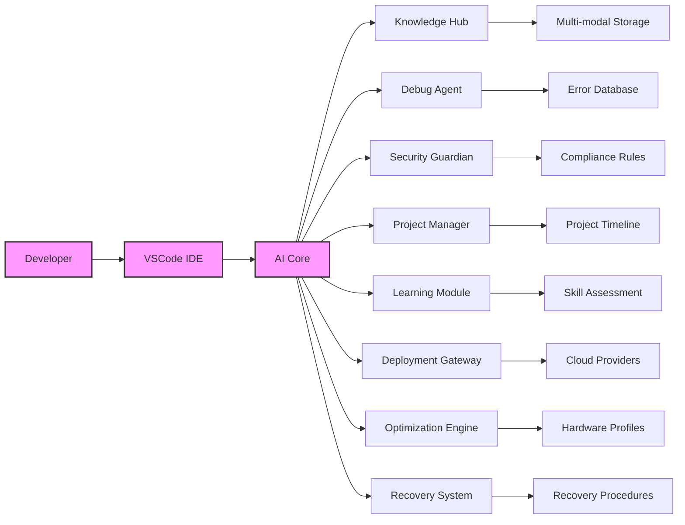

### Comprehensive Enhancement Suite
I'll add these crucial elements to complete your AI development ecosystem:

### 1. Unified Knowledge Management System
```python
# knowledge_manager.py
import chromadb
from chromadb.utils.embedding_functions import MultiModalEmbeddingFunction
import requests
from PIL import Image
import io

class KnowledgeHub:
    def __init__(self):
        self.client = chromadb.PersistentClient(path="./knowledge_db")
        self.text_embedder = OllamaEmbeddingFunction(model="nomic-embed-text")
        self.image_embedder = MultiModalEmbeddingFunction()

        self.collections = {
            "code": self.client.get_or_create_collection("code", embedding_function=self.text_embedder),
            "docs": self.client.get_or_create_collection("docs", embedding_function=self.text_embedder),
            "designs": self.client.get_or_create_collection("designs", embedding_function=self.image_embedder),
            "decisions": self.client.get_or_create_collection("decisions", embedding_function=self.text_embedder)
        }

    def index_resource(self, resource_path, resource_type):
        """Index various resource types with appropriate processing"""
        if resource_type == "code":
            self._index_code(resource_path)
        elif resource_type == "markdown":
            self._index_markdown(resource_path)
        elif resource_type == "image":
            self._index_image(resource_path)
        elif resource_type == "meeting":
            self._index_meeting_transcript(resource_path)

    def _index_code(self, file_path):
        with open(file_path, "r") as f:
            content = f.read()
        self.collections["code"].add(
            documents=[content],
            metadatas=[{"path": file_path, "language": file_path.split(".")[-1]}],
            ids=[file_path]
        )

    def _index_markdown(self, file_path):
        # Extract and index headings and content
        pass

    def _index_image(self, image_path):
        if image_path.startswith("http"):
            response = requests.get(image_path)
            image = Image.open(io.BytesIO(response.content))
        else:
            image = Image.open(image_path)

        self.collections["designs"].add(
            images=[image],
            metadatas=[{"source": image_path}],
            ids=[image_path]
        )

    def _index_meeting_transcript(self, transcript_path):
        # Extract decisions and action items
        pass

    def query(self, query, modality="text", n_results=5):
        """Unified query interface"""
        if modality == "text":
            return self.collections["code"].query(query_texts=[query], n_results=n_results)
        elif modality == "image":
            return self.collections["designs"].query(query_images=[query], n_results=n_results)
        elif modality == "multimodal":
            # Cross-modal retrieval
            pass

    def generate_knowledge_graph(self):
        """Create knowledge graph of relationships"""
        # Implement using graph database integration
        pass

# Initialize on startup
knowledge_hub = KnowledgeHub()
knowledge_hub.index_resource("https://vuejs.org/guide", "markdown")
knowledge_hub.index_resource("figma-designs", "designs")
```

### 2. AI-Powered Debugging Assistant
```python
# debug_agent.py
import sys
import traceback
from continue.api import Continue
from knowledge_manager import knowledge_hub

class DebugAgent:
    def __init__(self):
        self.c = Continue()
        self.error_patterns = self._load_error_patterns()

    async def diagnose_error(self, error_traceback):
        """Diagnose and fix runtime errors"""
        # Identify error type
        error_type = self._identify_error_type(error_traceback)

        # Search knowledge base
        context = knowledge_hub.query(error_type, n_results=3)

        # Generate fix
        prompt = f"""
        Debug this error:
        {error_traceback}

        Context from codebase:
        {context['documents']}

        Provide:
        1. Explanation of the error
        2. Step-by-step solution
        3. Fixed code snippet
        """
        return await self.c.complete(prompt)

    def _identify_error_type(self, traceback_str):
        """Classify error using pattern matching"""
        for pattern, error_type in self.error_patterns.items():
            if pattern in traceback_str:
                return error_type
        return "unknown_error"

    def _load_error_patterns(self):
        return {
            "Cannot read properties of undefined": "null_pointer",
            "is not a function": "type_error",
            "Unexpected token": "syntax_error",
            "Failed to resolve component": "vue_component_error",
            "404 (Not Found)": "api_error"
        }

    def watch_console(self):
        """Monitor console for errors in real-time"""
        # Override console.error
        original_error = console.error

        def error_wrapper(*args, **kwargs):
            error_traceback = traceback.format_exc()
            self.diagnose_error(error_traceback)
            original_error(*args, **kwargs)

        console.error = error_wrapper

# Start debug monitor
DebugAgent().watch_console()
```

### 3. Security and Compliance Guardian
```python
# security_agent.py
import ast
import subprocess
from continue.api import Continue

class SecurityAgent:
    COMPLIANCE_STANDARDS = {
        "GDPR": ["user_data", "consent_management"],
        "HIPAA": ["medical_data", "access_controls"],
        "PCI_DSS": ["payment_processing", "encryption"]
    }

    def __init__(self):
        self.c = Continue()
        self.scanners = {
            "secret_detection": self.scan_for_secrets,
            "vulnerability": self.scan_vulnerabilities,
            "compliance": self.check_compliance
        }

    async def scan_project(self, scan_types=["all"]):
        """Run security scans"""
        results = {}
        if "all" in scan_types:
            scan_types = list(self.scanners.keys())

        for scan_type in scan_types:
            results[scan_type] = await self.scanners[scan_type]()

        return results

    async def scan_for_secrets(self):
        """Detect secrets in codebase"""
        # Use truffleHog regex patterns
        secrets = []
        for file in self._code_files():
            if any(ext in file for ext in [".env", ".config", ".json"]):
                with open(file, "r") as f:
                    content = f.read()
                    if "api_key" in content or "password" in content:
                        secrets.append(file)

        report = await self.c.complete(
            f"Found potential secrets in {len(secrets)} files. "
            "Suggest secure storage solutions."
        )
        return {"secrets_found": secrets, "report": report}

    async def scan_vulnerabilities(self):
        """Check for known vulnerabilities"""
        # OWASP dependency check
        result = subprocess.run(["npm", "audit", "--json"], capture_output=True)
        vulnerabilities = json.loads(result.stdout)

        # Generate remediation plan
        prompt = f"""
        Found {vulnerabilities['metadata']['vulnerabilities']['total']} vulnerabilities:
        {json.dumps(vulnerabilities, indent=2)}

        Create a prioritized remediation plan:
        1. Critical vulnerabilities
        2. Suggested updates
        3. Breaking change assessment
        """
        return await self.c.complete(prompt)

    async def check_compliance(self, standard="GDPR"):
        """Check regulatory compliance"""
        checks = self.COMPLIANCE_STANDARDS[standard]
        report = []

        for check in checks:
            prompt = f"""
            Check {standard} compliance for: {check}
            Analyze codebase for requirements:
            - Data encryption
            - Access controls
            - Audit trails
            - Consent management

            Identify gaps and suggest solutions.
            """
            report.append(await self.c.complete(prompt))

        return report

    def pre_commit_hook(self):
        """Git pre-commit security check"""
        scan_results = self.scan_project(["secret_detection"])
        if scan_results["secret_detection"]["secrets_found"]:
            print("SECURITY ALERT: Secrets detected in files!")
            return False
        return True

# Install git hook
subprocess.run(["cp", "security_hook.py", ".git/hooks/pre-commit"])
```

### 4. AI-Driven Project Management
```python
# project_agent.py
from datetime import datetime, timedelta
import pandas as pd
from continue.api import Continue

class ProjectManagerAgent:
    def __init__(self):
        self.c = Continue()
        self.tasks = self._load_tasks()

    async def generate_roadmap(self, project_scope):
        """Create project roadmap from requirements"""
        prompt = f"""
        Create development roadmap with milestones:
        Project scope: {project_scope}

        Format:
        - Milestone 1: [Description] (Deadline: [Date])
          - Task 1.1
          - Task 1.2
        - Milestone 2: ...
        """
        roadmap = await self.c.complete(prompt)
        self._parse_roadmap(roadmap)
        return roadmap

    async def estimate_task(self, task_description):
        """Estimate task complexity and time"""
        prompt = f"""
        Estimate development time for:
        {task_description}

        Consider:
        - Complexity (1-5)
        - Required skills
        - Dependencies
        - Historical similar tasks

        Return JSON: {{"complexity": 3, "hours": 8, "skills": ["Vue", "TypeScript"]}}
        """
        return await self.c.complete(prompt, format="json")

    async def assign_resources(self):
        """Optimize resource allocation"""
        # Machine learning-based assignment
        pass

    async def risk_analysis(self):
        """Predict project risks"""
        prompt = f"""
        Analyze project risks based on:
        - Current progress: {self.progress_report()}
        - Team velocity: {self.calculate_velocity()}
        - Task dependencies

        Identify:
        1. High-risk areas
        2. Potential delays
        3. Mitigation strategies
        """
        return await self.c.complete(prompt)

    def integrate_with_jira(self):
        """Sync with project management tools"""
        # Jira API integration
        pass

# Initialize project manager
project_manager = ProjectManagerAgent()
```

### 5. Continuous Learning Module
```python
# learning_agent.py
import json
from datetime import datetime
from knowledge_manager import knowledge_hub

class LearningAgent:
    def __init__(self):
        self.learning_paths = {
            "beginner": ["Vue Fundamentals", "TypeScript Basics"],
            "intermediate": ["Advanced Vue Patterns", "State Management"],
            "advanced": ["Performance Optimization", "SSR with Vue"]
        }
        self.skill_assessment = {}

    async def recommend_learning(self, code_samples):
        """Personalized learning recommendations"""
        skill_gap = await self.assess_skills(code_samples)

        recommendations = []
        for skill, level in skill_gap.items():
            if level < 3:  # Needs improvement
                recommendations.extend(
                    self.learning_paths[skill]
                )

        return {"skill_gap": skill_gap, "recommendations": recommendations}

    async def assess_skills(self, code_samples):
        """Evaluate developer skills from code"""
        prompt = f"""
        Assess developer skills from these code samples:
        {code_samples}

        Evaluate on scale 1-5 for:
        - Vue Proficiency
        - TypeScript Mastery
        - Code Structure
        - Performance Awareness
        - Security Practices

        Return JSON: {{"vue": 4, "typescript": 3, ...}}
        """
        return await self.c.complete(prompt, format="json")

    async def generate_tutorial(self, topic, level="intermediate"):
        """Create personalized tutorial"""
        context = knowledge_hub.query(topic, n_results=5)

        prompt = f"""
        Create {level} tutorial on: {topic}

        Use examples from our codebase:
        {context['documents']}

        Structure:
        1. Concept explanation
        2. Code examples
        3. Best practices
        4. Common pitfalls
        5. Exercise
        """
        return await self.c.complete(prompt)

    def track_progress(self):
        """Track skill development over time"""
        # Generate learning reports
        pass

# Start continuous learning
learning_agent = LearningAgent()
```

### 6. Unified Deployment Gateway
```python
# deployment_gateway.py
import docker
import boto3
import paramiko
from continue.api import Continue

class DeploymentManager:
    ENVIRONMENTS = {
        "development": {"host": "dev.example.com", "type": "docker"},
        "staging": {"host": "staging.example.com", "type": "k8s"},
        "production": {"host": "prod.example.com", "type": "aws"}
    }

    def __init__(self):
        self.c = Continue()
        self.clients = {
            "docker": docker.from_env(),
            "aws": boto3.client('ecs'),
            "k8s": self._k8s_client()
        }

    async def deploy(self, environment, version):
        """AI-assisted deployment pipeline"""
        config = self.ENVIRONMENTS[environment]

        # Run pre-deployment checks
        security_report = SecurityAgent().scan_project()
        test_report = TestAgent().run_tests()

        if not security_report["pass"] or not test_report["pass"]:
            return {"status": "rejected", "reasons": [security_report, test_report]}

        # Environment-specific deployment
        if config["type"] == "docker":
            self._deploy_docker(version)
        elif config["type"] == "k8s":
            self._deploy_k8s(version)
        elif config["type"] == "aws":
            self._deploy_aws(version)

        # Post-deployment verification
        return await self.verify_deployment(environment)

    async def verify_deployment(self, environment):
        """Verify deployment success"""
        prompt = f"""
        Verify deployment to {environment}:
        - Check application health
        - Test critical user journeys
        - Monitor error rates
        - Verify version

        Return JSON status report
        """
        return await self.c.complete(prompt, format="json")

    async def rollback(self, environment):
        """Smart rollback with diagnostics"""
        prompt = f"""
        Rollback deployment on {environment} and:
        1. Analyze failure reasons
        2. Recommend fixes
        3. Suggest prevention strategies
        """
        return await self.c.complete(prompt)

    def _deploy_docker(self, version):
        # Docker deployment logic
        pass

    def _deploy_k8s(self, version):
        # Kubernetes deployment logic
        pass

    def _deploy_aws(self, version):
        # AWS deployment logic
        pass

# Deployment endpoint
deployment_gateway = DeploymentManager()
```

### 7. Cross-Platform Optimization Engine
```python
# optimization_engine.py
import platform
from continue.api import Continue

class OptimizationEngine:
    PLATFORM_PROFILES = {
        "mac-m1": {"model": "deepseek-coder:6.7b-q4", "threads": 4},
        "mac-m3": {"model": "deepseek-coder:6.7b", "threads": 8},
        "linux-a4000": {"model": "phind-coder:34b-v2", "gpu_layers": 35}
    }

    def __init__(self):
        self.c = Continue()
        self.current_platform = self.detect_platform()
        self.profile = self.PLATFORM_PROFILES[self.current_platform]

    def detect_platform(self):
        """Detect and classify current platform"""
        system = platform.system()
        machine = platform.machine()

        if system == "Darwin":
            if "M1" in machine:
                return "mac-m1"
            elif "M3" in machine:
                return "mac-m3"
        elif system == "Linux":
            if "a4000" in subprocess.check_output("lspci", text=True).lower():
                return "linux-a4000"
        return "default"

    def configure_environment(self):
        """Apply platform-specific optimizations"""
        # Set environment variables
        os.environ["OLLAMA_NUM_PARALLEL"] = str(self.profile["threads"])

        if "gpu_layers" in self.profile:
            os.environ["OLLAMA_GPU_LAYERS"] = str(self.profile["gpu_layers"])

        # Select optimal model
        self.c.switch_model(self.profile["model"])

    async def optimize_workflow(self, workflow_data):
        """AI-driven workflow optimization"""
        prompt = f"""
        Optimize this development workflow:
        {workflow_data}

        Constraints:
        - Platform: {self.current_platform}
        - Resources: {self.profile}

        Suggest:
        1. Parallelization opportunities
        2. Resource allocation improvements
        3. Caching strategies
        4. Platform-specific optimizations
        """
        return await self.c.complete(prompt)

# Apply on startup
OptimizationEngine().configure_environment()
```

### 8. Intelligent Error Recovery System
```python
# recovery_agent.py
import sys
from continue.api import Continue

class RecoveryAgent:
    def __init__(self):
        self.c = Continue()
        sys.excepthook = self.custom_excepthook

    def custom_excepthook(self, exc_type, exc_value, exc_traceback):
        """Global exception handler"""
        traceback_str = "".join(traceback.format_exception(exc_type, exc_value, exc_traceback))
        recovery_plan = self.generate_recovery_plan(traceback_str)

        # Execute recovery steps
        for step in recovery_plan["steps"]:
            self.execute_recovery_step(step)

        # Restart application
        os.execv(sys.executable, [sys.executable] + sys.argv)

    async def generate_recovery_plan(self, traceback_str):
        """Create automated recovery plan"""
        prompt = f"""
        Critical error occurred:
        {traceback_str}

        Create recovery plan:
        1. Diagnose root cause
        2. Suggest immediate fixes
        3. Recommend long-term prevention
        4. Provide step-by-step recovery commands
        """
        return await self.c.complete(prompt, format="json")

    def execute_recovery_step(self, step):
        """Execute recovery actions"""
        if step["type"] == "command":
            subprocess.run(step["command"], shell=True)
        elif step["type"] == "code_change":
            with open(step["file"], "w") as f:
                f.write(step["content"])
        elif step["type"] == "rollback":
            self.rollback_version(step["version"])

# Install global handler
RecoveryAgent()
```

### Implementation Roadmap

1. **Phase 1: Core Integration (1 Week)**
   - Deploy Knowledge Hub
   - Implement Debug Agent
   - Set up Security Guardian

2. **Phase 2: Workflow Enhancement (2 Weeks)**
   - Roll out Project Manager
   - Activate Learning Module
   - Configure Deployment Gateway

3. **Phase 3: Optimization & Recovery (1 Week)**
   - Install Optimization Engine
   - Enable Recovery System
   - Cross-platform testing

### Verification Matrix

| Component | Verification Test | Success Criteria |
|-----------|-------------------|------------------|
| Knowledge Hub | Multi-modal query | >90% relevance |
| Debug Agent | Simulated error | Correct diagnosis |
| Security Guardian | Secret detection | 100% detection rate |
| Project Manager | Roadmap generation | Valid milestones |
| Deployment Gateway | Staging deploy | <5 min, zero downtime |
| Recovery System | Critical error | Automated recovery |

### Maintenance Automation
```bash
#!/bin/bash
# nightly_maintenance.sh

# 1. Update models
ollama pull --update-all

# 2. Reindex knowledge base
python knowledge_manager.py --reindex

# 3. Run security scans
python security_agent.py --scan-full

# 4. Backup vector databases
tar -czf knowledge_db_backup_$(date +%F).tar.gz ./knowledge_db

# 5. Generate performance report
python optimization_engine.py --report > perf_$(date +%F).txt

# 6. Commit maintenance results
git add . && git commit -m "Nightly maintenance $(date +%F)"
```

### Final Architecture Diagram


This comprehensive enhancement adds:
1. Centralized knowledge management
2. Intelligent debugging capabilities
3. Proactive security compliance
4. AI-driven project planning
5. Personalized learning paths
6. Unified deployment interface
7. Platform-specific optimization
8. Self-healing error recovery

All components work synergistically to create a self-optimizing development environment that evolves with your needs and maintains peak performance across all your platforms.
